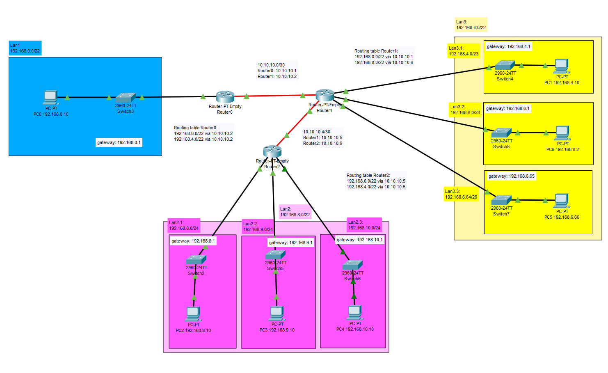

# Zadanie 2

Projekt sieci spełnił oczekiwania, organizacja po uwzględnieniu nowych wymogów chce podzielić dotychczasowe sieci na kilka podsieci.

1. Zaprojektuj oraz udokumentuj prototyp rozwiązania z wykorzystaniem oprogramowania ``CISCO Packet Tracer``, ``VirtualBox`` lub podobnego. 

## Schemat

## Charakterystyka
  * LAN 1 pozostaje bez zmian
  * LAN 2 zostaje podzielony na 3 równe podsieci
  * LAN 3 zostaje podzielony na 3 podsieci z uwzględnieniem
    * podsieć 1 ma obsłużyć do 512 hostów
    * podsieć 2 ma obsłużyć do 10 hostów
    * podsieć 3 ma obsłużyć do 32 hostów
  * Usunięty został również link pomiędzy Routerem (LAN 1) a Routerem (LAN 2)
  * Uwzględnij zmiany w tablicy routingów

## Zawartość

 * Adresy poszczególnych sieci IP
 * Adresację linków pomiędzy routerami
 * Tablice routingów na poszczególnych routerach

| Siec   | Adres sieci | Host min     | Host max      | Adres rozgłoszeniowy | Maska |
| -------------     |:-------------: | -----:       | -----:        | -----:    | -----:    |
|   LAN1       | 192.168.0.0 | 192.168.0.1   | 192.168.3.254 | 192.168.3.255  | 255.255.252.0 |
|   LAN2     | 192.168.8.0 |   192.168.8.1  | 192.168.11.254 | 192.168.11.255 | 255.255.252.0 |
|   LAN3   | 192.168.4.0 | 192.168.4.1 | 192.168.7.254 | 192.168.7.255 | 255.255.252.0 |

LAN2

| Podsiec   | Adres podsieci | Host min     | Host max     | Max liczba hostów | Adres rozgłoszeniowy | Maska |
| -------------     |:-------------: | -----:       | -----:  | -----:   | -----:    | -----:    |
|   LAN2.1       | 192.168.8.0 | 192.168.8.1   | 192.168.8.254| 254  | 192.168.8.255  | 255.255.255.0 |
|   LAN2.2    | 192.168.9.0 |   192.168.9.1  | 192.168.9.254  | 254 | 192.168.9.255 | 255.255.255.0 |
|   LAN2.3   | 192.168.10.0 | 192.168.10.1 | 192.168.10.254   | 254  | 192.168.10.255 | 255.255.255.0 |
 
 LAN3

| Podsiec   | Adres podsieci | Host min     | Host max     | Max liczba hostów | Adres rozgłoszeniowy |  Maska  |
| -------------     |:-------------: | -----:       | -----:  | -----:   | -----:    | -----:    |
|   LAN3.1       | 192.168.4.0 | 192.168.4.1   | 192.168.5.254| 510  | 192.168.5.255  | 255.255.254.0 |
|   LAN3.2    | 192.168.6.0 |   192.168.6.1  | 192.168.6.14  | 14 | 192.168.6.15 | 255.255.255.240 |
|   LAN3.3   | 192.168.6.64 | 192.168.6.65 | 192.168.6.126   | 62  | 192.168.6.127 | 255.255.255.192 |

 
