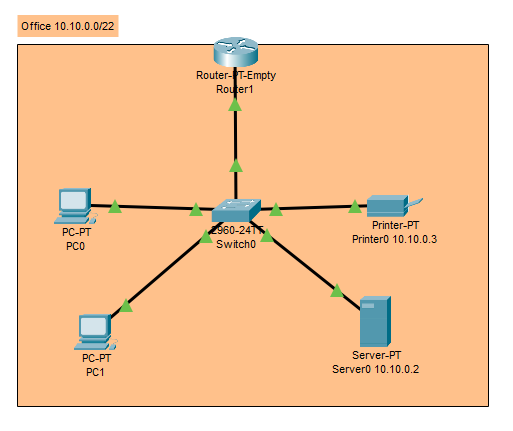
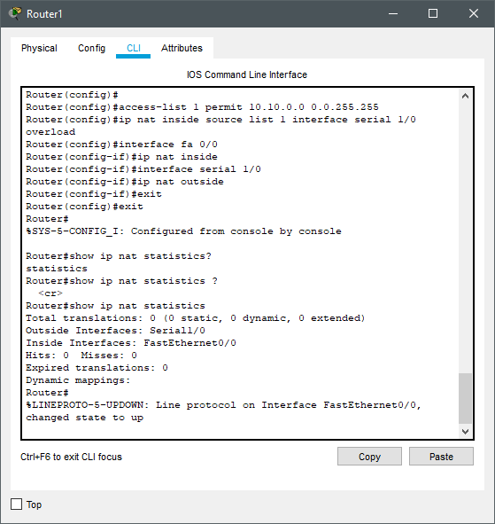
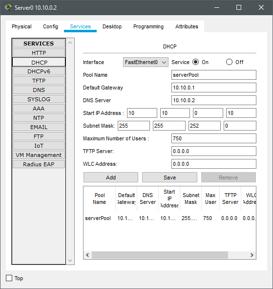
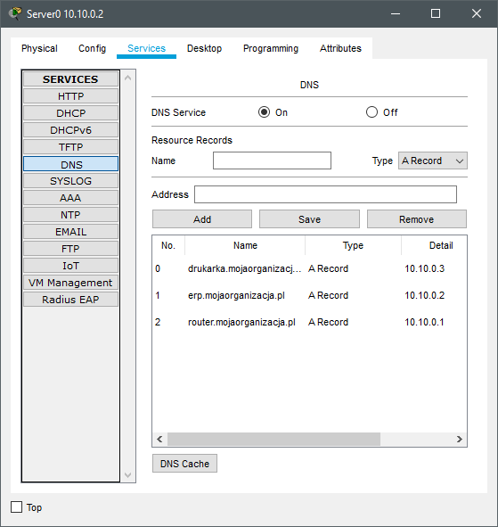

# Zadanie 1

Organizacja planuje ulepszyć działanie istniejącej sieci biurowej.

1. Zaprojektuj oraz udokumentuj konfigurację prototypu rozwiązania z wykorzystaniem oprogramowania ``VirtualBox`` lub podobnego. 

## Wymagania

W sieci pracują komputery biurowe oraz urządzenia siecowe współdzielące zasoby. Do tej pory organizacja borykała się z ręczna konfiguracją urządzeń oraz adresami IP które dla ludzi z poza kadry technicznej były niezrozumiałe. Postanowiono:

* Wykorzystać usługę DHCP do nadawania adresów w sposób automatyczny dla wszystkich stacji roboczych
* Serwer oraz durządzenia IP tj: drukarka muszą posiadać stałe adresy celem zminimalizowanai potrzeby rekonfiguracji ustawiań klientów
* Wprowadzić translację pomiędzy Adresami IP oraz nazwami domenowymi dla kluczowych zasobów
   - erp.mojaorganizacja.pl
   - drukarka.mojaorganizacja.pl
   - router.mojaorganizacja.pl
* Wszystkie urządzenia łączą się z siecią internet z wykorzystaniem bramy NAT
* Wykorzystać podsieć rozmiaru /22 pozwalającej zaadresować co najmniej 600 urządzeń

## Dokumentacja

   1. Konfiguracja NAT
   
   
   
   2. Konfiguracja DHCP
   
   
   
   3. Konfiguracja DNS
   
   
   
   4. Konfiguracja interfejsów sieciowych

Konfiguracja statyczna:

| Nazwa urządzenia   | Adres | Maska     | Gateway     | DNS |
| -------------     |:-------------: | -----:       | -----:  | -----:   |
|   Printer0 | 10.10.0.3  | 255.255.252.0    | 10.10.0.1| 10.10.0.2  |
|   Server0  | 10.10.0.2 |   255.255.252.0   | 10.10.0.1  | 10.10.0.2|
|   Router1  | 10.10.0.1 | 255.255.252.0 | 10.10.0.1  | 10.10.0.2  |

Router1 posiada 2 interface: fastethernet 0/0 z adresem 10.10.0.1/22 oraz serial1/0 z adresem 192.168.200.240/27
PC0 i PC1 posiadają protokół dynamicznego konfigurowania hostów.
